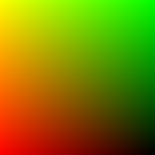
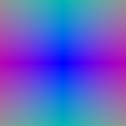
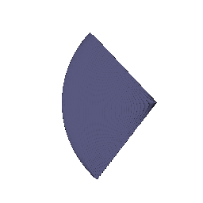
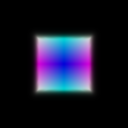
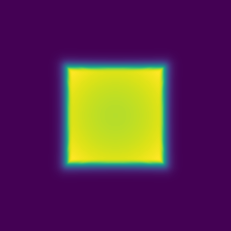
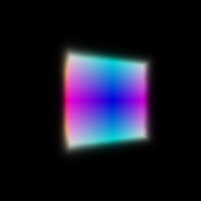
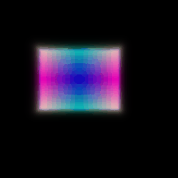
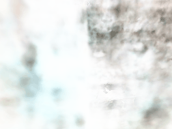
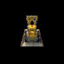
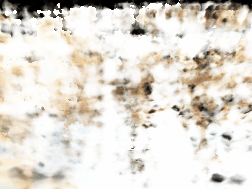

# Neural Volume Rendering

A PyTorch implementation of **differentiable volume rendering** and **neural scene reconstruction** — building from first-principles ray casting all the way to a fully trained Neural Radiance Field (NeRF) that synthesizes novel views of a 3D scene from nothing but 2D images.

The pipeline covers emission-absorption volume rendering, inverse rendering, NeRF with positional encoding, sphere tracing, neural SDF reconstruction from point clouds, and VolSDF. Everything runs locally — no external APIs, no cloud rendering.

---

## What This Project Is About

The central question this project answers is: **how do you represent a 3D scene so that you can render it from any viewpoint, and how do you recover that representation from only 2D photographs?**

This is the problem at the heart of modern 3D vision. The approach here is fully differentiable — every rendering step is connected to gradients, which means the system can be trained end-to-end from image supervision alone. The progression moves from analytic geometry (a box defined by a signed distance function) through to a neural network that implicitly encodes a full 3D scene as learned weights.

The final result — a NeRF trained on the Lego bulldozer dataset — produces smooth, photorealistic 360° novel views from a viewpoint that was never seen during training.

---

## Pipeline Overview

Every stage of this project flows through the same four-step rendering pipeline:

```
Camera + Image Size
        │
        ▼
  Ray Generation          ray_utils.py
  NDC pixel grid → world-space ray origins and directions
        │
        ▼
  Point Sampling          sampler.py
  Sample N 3D points along each ray between near/far depth planes
        │
        ▼
  Implicit Evaluation     implicit.py
  Query density + color at every sample point
  (analytic SDF, or neural MLP)
        │
        ▼
  Volume Rendering        renderer.py
  Transmittance-weighted integration → RGB pixel color + depth
        │
        ▼
  images/  (GIFs, depth maps, visualizations)
```

For surface rendering (sphere tracing), ray generation feeds directly into iterative SDF queries rather than volumetric integration.

---

## Setup

### Requirements

- Python 3.x
- PyTorch + PyTorch3D
- CUDA-capable GPU (recommended for NeRF training)
- Conda (Miniconda or Anaconda)

### Install

```bash
conda env create -f environment.yml
conda activate l3d
```

### Data

Core scene data is included under `data/`. For the `materials` scene used in the NeRF and VolSDF experiments, download the dataset zip and unzip it into `data/`:

> [Download materials dataset from Google Drive](https://drive.google.com/file/d/1v_0w1bx6m-SMZdqu3IFO71FEsu-VJJyb/view?usp=sharing)

---

## Running the Pipeline

| Stage | Command |
|---|---|
| Volume render a box | `python volume_rendering_main.py --config-name=box` |
| Inverse rendering — fit box from images | `python volume_rendering_main.py --config-name=train_box` |
| Train NeRF on Lego | `python volume_rendering_main.py --config-name=nerf_lego` |
| Sphere tracing — torus | `python -m surface_rendering_main --config-name=torus_surface` |
| Neural SDF from point cloud | `python -m surface_rendering_main --config-name=points_surface` |
| VolSDF — geometry + color from images | `python -m surface_rendering_main --config-name=volsdf_surface` |

All outputs are written to `images/`.

---

## Stage-by-Stage Results

The stages below are ordered by complexity. Each one builds directly on the last.

---

### Stage 1 — Ray Generation and Pixel Grid

Before any rendering can happen, we need to know where the rays are going. This stage implements the full ray generation pipeline: a pixel grid is created in normalized device coordinates (NDC), unprojected into world space using the camera's intrinsics, and paired with ray directions computed from the camera center.

**What you see below:** The pixel coordinate grid (left) and the corresponding ray directions visualized as a color field (right). The smooth gradient confirms the rays are correctly spanning the image plane — each color encodes a direction in XYZ space.

<div align="center">

| NDC Pixel Grid | Ray Directions |
|:-:|:-:|
|  |  |

</div>

---

### Stage 2 — Point Sampling Along Rays

With rays defined, the next step is to place 3D sample points along each one. A `StratifiedRaysampler` divides each ray into the depth interval `[near, far]` and places `N` equally-spaced sample distances. Each point is computed as:

```
P_i = origin + direction × t_i
```

The point cloud below shows all sample points from one camera view — the fan-shaped distribution confirms the stratified samples correctly fill the viewing frustum.

<div align="center">

**Sampled Points Along Rays**



</div>

---

### Stage 3 — Volume Rendering: Emission-Absorption Model

With sample points placed, we can now render. This stage implements the core emission-absorption (EA) volume rendering integral from Mildenhall et al. (NeRF, 2020).

For each sample point, a density `σ` and color `c` are computed from an SDF-based implicit volume. The rendering weights are:

```
α_i  = 1 − exp(−σ_i × Δt_i)            # opacity of segment i
T_i  = ∏_{j < i} (1 − α_j)              # transmittance: light surviving to point i
w_i  = T_i × α_i                         # final rendering weight
```

Pixel color and depth are then aggregated as weighted sums:

```
C = Σ w_i × c_i      (color)
D = Σ w_i × t_i      (depth)
```

The scene is a box defined by an analytic signed distance function (SDF) with a rainbow color scheme (color = absolute distance from center in each axis). The depth map encodes distance from the camera — brighter = closer.

<div align="center">

| Rendered Color | Depth Map (grayscale) | Depth Map (colormap) |
|:-:|:-:|:-:|
|  |  |  |

</div>

**Spiral render — 20 views around the box:**

<div align="center">

</div>

> The soft edges visible in both the color and depth render are a property of the SDF-to-density conversion: a Laplace CDF maps signed distances to densities, creating a smooth falloff at the surface boundary rather than a hard edge. This is intentional — it keeps the rendering differentiable.

---

### Stage 4 — Inverse Rendering: Recovering Geometry from Images

This stage demonstrates the power of differentiable rendering. Rather than rendering a known scene, we flip the problem: **given 2D images from multiple viewpoints, recover the box's 3D shape**.

The box's `center` and `side_lengths` parameters are made learnable. Training samples random batches of pixels each iteration, renders them, and computes MSE loss against ground-truth pixel colors:

```
loss = MSE(rgb_predicted, rgb_groundtruth)
```

Gradients flow all the way back through the renderer → density → SDF → geometry parameters. No 3D supervision is used — only image pixels.

**Before training** (random initialization) vs **after training** (converged geometry):

<div align="center">

| Before Training | After Training |
|:-:|:-:|
|  |  |

</div>

**Spiral render after training — geometry recovered from images:**

<div align="center">

</div>

> Box center and side lengths converge toward the ground-truth values over training. The model learns 3D geometry purely from 2D image supervision — this is the core principle behind all inverse rendering systems, including NeRF.

---

### Stage 5 — Neural Radiance Field (NeRF)

This is where the system scales from an analytic SDF to a fully learned scene representation. Instead of a hand-crafted geometric primitive, the scene is encoded in the weights of a multi-layer perceptron (MLP) that maps 3D position (and optionally viewing direction) to density and color.

**Architecture:**

```
3D point (x, y, z)
    │
    ▼  HarmonicEmbedding — positional encoding
    │  [sin(2^k · x), cos(2^k · x)] for k = 0..5 → 39-dim
    ▼
 MLPWithInputSkips — 6 layers, 128 hidden units
    │  skip connection re-injects input at layer 3
    │
    ├──► density head → σ (ReLU, view-independent)
    │
    └──► + view direction (2 harmonic functions → 32-dim)
         ▼
      color MLP → RGB ∈ [0, 1]  (view-dependent)
```

Two key design decisions:
- **Positional encoding** lifts raw XYZ into a high-frequency feature space, enabling the MLP to represent fine detail (without it, the network produces blurry results)
- **View-dependent color** separates geometry (density, position-only) from appearance (color, position + direction), correctly modelling specular effects and lighting

**Training:** 250 epochs on the Lego bulldozer dataset (128×128 resolution), Adam optimizer with LR=5e-4, exponential decay ×0.8 every 50 epochs, batch size of 1024 rays per iteration.

**Pre-training render (before training converges):**

<div align="center">

</div>

**After training — novel view synthesis of the Lego bulldozer:**

<div align="center">

</div>

**Fully trained NeRF — high-quality 360° spiral:**

<div align="center">

</div>

> Every frame in the final GIF is rendered from a viewpoint that was **never seen during training**. The MLP has learned a continuous 3D representation of the scene from multi-view image supervision alone. The structural detail — tread texture, arm geometry, cab geometry — is all recovered from gradients.

---

### Fern Scene (Forward-Facing NeRF)

The same pipeline trained on the forward-facing Fern dataset demonstrates generalization beyond object-centric scenes. Forward-facing scenes require a different camera parameterization but use the same rendering and training logic.

<div align="center">

</div>

---

## Repository Structure

| File | Role |
|---|---|
| `volume_rendering_main.py` | Entry point: render, train box, train NeRF |
| `surface_rendering_main.py` | Entry point: sphere tracing, neural SDF, VolSDF |
| `ray_utils.py` | Pixel grids, NDC→world ray generation, random pixel sampling |
| `sampler.py` | Stratified point sampling along rays |
| `renderer.py` | VolumeRenderer, SphereTracingRenderer, VolumeSDFRenderer |
| `implicit.py` | SDFVolume, NeuralRadianceField, NeuralSurface, SDF primitives |
| `losses.py` | Eikonal loss, sphere pre-training loss, sampling helpers |
| `configs/*.yaml` | Hydra configs — each YAML is a complete experiment |

---

## Technical Reference

### Emission-Absorption Rendering Integral

The volume rendering equation integrates color along a ray:

$$C(\mathbf{r}) = \int_{t_n}^{t_f} T(t) \cdot \sigma(\mathbf{r}(t)) \cdot \mathbf{c}(\mathbf{r}(t), \mathbf{d}) \, dt$$

where $T(t) = \exp\!\left(-\int_{t_n}^{t} \sigma(\mathbf{r}(s))\,ds\right)$ is the accumulated transmittance. In discrete form over $N$ samples:

$$\hat{C} = \sum_{i=1}^{N} T_i \alpha_i \mathbf{c}_i, \quad T_i = \prod_{j=1}^{i-1}(1 - \alpha_j), \quad \alpha_i = 1 - e^{-\sigma_i \delta_i}$$

### SDF to Density (Laplace CDF)

Analytic SDFs and NeuralSurface both convert signed distances to density via:

$$\rho(s) = \begin{cases} \frac{\alpha}{2} e^{s/\beta} & s \leq 0 \\ \alpha\left(1 - \frac{1}{2}e^{-s/\beta}\right) & s > 0 \end{cases}$$

$\alpha$ controls the density scale; $\beta$ controls surface sharpness (smaller $\beta$ → sharper boundary).

### Positional Encoding

Raw 3D coordinates are lifted to a higher-dimensional feature space before being passed to the NeRF MLP:

$$\gamma(\mathbf{x}) = \left[\sin(2^0 \mathbf{x}),\ \cos(2^0 \mathbf{x}),\ \ldots,\ \sin(2^{L-1} \mathbf{x}),\ \cos(2^{L-1} \mathbf{x}),\ \mathbf{x}\right]$$

With $L=6$ for position and $L=2$ for view direction, the 3D input is lifted to a 39-dim and 15-dim vector respectively.

---

## Acknowledgements

Rendering model and NeRF architecture based on:
- Mildenhall et al., *NeRF: Representing Scenes as Neural Radiance Fields for View Synthesis*, CACM 65, 1 (2021)

Datasets: ShapeNet (shapenet.org), NeRF synthetic dataset.
SDF primitive formulas: Inigo Quilez, [iquilezles.org/articles/distfunctions](https://iquilezles.org/articles/distfunctions/).
Project structure adapted from Shubham Tulsiani, Carnegie Mellon University — Learning for 3D Vision.
