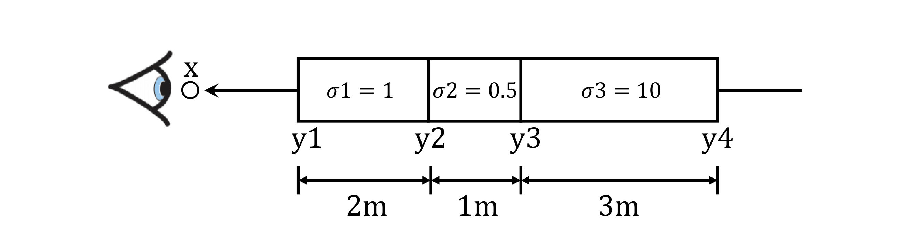

# Neural Volume Rendering — Implementation Notes

## Setup

### Environment

Create and activate the conda environment:

```bash
conda env create -f environment.yml
conda activate l3d
```

If you don't have Anaconda, install [Miniconda](https://docs.conda.io/en/latest/miniconda.html) or use:

```bash
wget https://repo.anaconda.com/miniconda/Miniconda3-latest-Linux-x86_64.sh
chmod +x Miniconda3-latest-Linux-x86_64.sh
bash Miniconda3-latest-Linux-x86_64.sh
```

### Data

Core data lives under `data/`. The materials scene is large; download the zip from [Google Drive](https://drive.google.com/file/d/1v_0w1bx6m-SMZdqu3IFO71FEsu-VJJyb/view?usp=sharing) and unzip into `data/`.

---

# A. Neural Volume Rendering

## 0. Transmittance Calculation

Transmittance is central to volume rendering: it describes how much light survives along a ray through a non-homogeneous medium. Deriving it by hand (e.g. in `transmittance_calculation/a3_transmittance.pdf` or a similar document) clarifies the math used in the renderer. A figure such as the one below illustrates the setup.



---

## 1. Differentiable Volume Rendering

In the emission-absorption (EA) model, volumes are described by *appearance* (e.g. emission/color) and *geometry* (absorption/density) at every 3D point. This section implements a **differentiable** EA renderer so that scene parameters can be optimized from images (inverse rendering).

### 1.1. Code structure

The pipeline has four main pieces:

- **Camera** — `pytorch3d.CameraBase` (intrinsics, pose).
- **Scene** — `SDFVolume` in `implicit.py` (SDF → density/color).
- **Sampler** — `StratifiedSampler` in `sampler.py` (points along rays / raymarching).
- **Renderer** — `VolumeRenderer` in `renderer.py` (weights + aggregation → image).

The sampler and renderer are scene-agnostic. The `Model` class in `volume_rendering_main.py` ties camera, scene, sampler, and renderer together; its forward calls the renderer with the sampler and implicit volume. `RayBundle` in `ray_utils.py` holds ray origins, directions, sample points, and sample lengths per ray.

### 1.2. Implementation outline

1. **Ray sampling** — In `ray_utils.py`, generate world-space rays for each pixel (NDC → world).
2. **Point sampling** — In `sampler.py`, implement `StratifiedSampler` to place sample points along each ray.
3. **Rendering** — In `renderer.py`, implement weight computation and aggregation to turn per-sample density/color into pixel color and depth.

### 1.3. Ray sampling

`render_images` in `volume_rendering_main.py` loops over cameras, builds rays per pixel, and renders with the `Model`.

**Implement:**

1. `get_pixels_from_image(image_size, camera)` in `ray_utils.py` — pixel coordinates in NDC, range `[-1, 1]` for x and y.
2. `get_rays_from_pixels(xy_grid, image_size, camera)` in `ray_utils.py` — map those NDC coordinates to world-space ray origins and directions (e.g. unproject image plane, ray origin = camera center, direction = normalized vector to unprojected point).

Usage in `render_images`:

```python
xy_grid = get_pixels_from_image(image_size, camera)
ray_bundle = get_rays_from_pixels(xy_grid, image_size, camera)
```

**Visualization:** Use `vis_grid` and `vis_rays` on the first camera to inspect the grid and rays. Run:

```bash
# mkdir images  # when needed
python volume_rendering_main.py --config-name=box
```

Reference outputs: grid and rays (e.g. `ta_images/grid.png`, `ta_images/rays.png`).

### 1.4. Point sampling

**Implement** `StratifiedSampler` in `sampler.py` (forward method):

1. Generate distances (e.g. linearly) between `near` and `far` for each ray.
2. Compute sample positions: `origins + directions * t` and store in `RayBundle.sample_points`.
3. Store the distances in `RayBundle.sample_lengths`.

**Visualization:** Use `render_points` in `render_functions.py` on the first camera’s sample points (e.g. `ta_images/sample_points.png`).

### 1.5. Volume rendering

With `configs/box.yaml`, the scene is an `SDFVolume` (box SDF) in `implicit.py`. You can add other SDFs to `sdf_dict`; see [Inigo Quilez’s SDF formulas](https://iquilezles.org/articles/distfunctions/).

**Implement:**

1. **`VolumeRenderer._compute_weights`** — From density σ and segment length Δt, compute opacity α = 1 − exp(−σ Δt) and transmittance T along the ray; weights are T × α (with T = 1 for the first segment).
2. **`VolumeRenderer._aggregate`** — Weighted sum of features (e.g. color) and of depths using those weights.
3. **`VolumeRenderer.forward`** — Besides color, output a depth map (e.g. weighted sum of `RayBundle.sample_lengths`).

The implicit function returns `density` and `feature` (color) per sample. Use the standard EA equations: transmittance, then weights T×(1−exp(−σ Δt)), then aggregate. Depth should be normalized by its max for visualization (e.g. save to `images/depth.png`). Spiral output: `images/part_1.gif`.

---

## 2. Optimizing a Basic Implicit Volume

Use the differentiable renderer to fit volume parameters (e.g. box center and side lengths) to ground-truth images with known cameras.

### 2.1. Random ray sampling

Volume rendering is memory-heavy (many samples per ray, backward pass). For training, sample a **subset of rays** per iteration. Implement `get_random_pixels_from_image(n_pixels, image_size, camera)` in `ray_utils.py` to return a random subset of pixel coordinates (e.g. by calling `get_pixels_from_image` and then randomly subsampling).

### 2.2. Loss and training

In the `train` function in `volume_rendering_main.py`, set the loss to **MSE** between predicted and ground-truth RGB at the sampled pixels. Train with the box config; the optimizer updates the box’s center and side lengths.

```bash
python volume_rendering_main.py --config-name=train_box
```

After training, the spiral sequence is in `images/part_2.gif`. You can report the optimized center and side lengths (e.g. rounded to two decimals).

### 2.3. Visualization

Spiral of the optimized volume: `images/part_2.gif`.

---

## 3. Optimizing a Neural Radiance Field (NeRF)

Replace the analytic SDF volume with an **MLP** that maps 3D position (and optionally view direction) to density and color. Train it on a set of RGB images with known poses.

**Implement:**

1. **`NeuralRadianceField`** in `implicit.py` — Forward takes a `RayBundle`, evaluates the MLP at each sample point, and returns `density` (e.g. ReLU of one output) and `feature` (e.g. Sigmoid of three outputs for RGB). Use `HarmonicEmbedding` for positional encoding.
2. **Loss in `train_nerf`** in `volume_rendering_main.py` — MSE between rendered and ground-truth RGB at sampled pixels.

Notes: ReLU on density keeps it non-negative; Sigmoid on color keeps RGB in [0,1]. Positional encoding improves quality. View dependence is optional (can add a second input for view direction and an extra MLP branch).

```bash
python volume_rendering_main.py --config-name=nerf_lego
```

Training uses the lego dataset (e.g. 250 epochs, 128×128). Spiral: `images/part_3.gif`. Settings in `configs/nerf_lego.yaml` can be tuned.

---

## 4. NeRF Extras

### 4.1. View dependence

Let emission (color) depend on viewing direction: add view-direction encoding and a small MLP that combines geometry features with view features to predict RGB. Trade-off: better specular/reflection effects vs risk of overfitting to training views. Materials scene configs: `nerf_materials.yaml`, `nerf_materials_highres.yaml`.

### 4.2. Coarse/fine sampling

Use two networks: a coarse one for geometry, then importance sampling of ray positions using that geometry, then a fine network for the final color/density. Trade-off: better quality and sample placement vs more compute.

---

# B. Neural Surface Rendering

## 5. Sphere Tracing

Sphere tracing renders an **SDF** by marching along each ray by steps equal to the current SDF value until convergence or max iterations. No volumetric sampling; you get a single hit point per ray.

**Implement** `sphere_tracing(implicit_fn, origins, directions)` in `renderer.py`:

- **Returns:** `(points, mask)` — `points`: intersection position per ray (any value for non-hit rays); `mask`: boolean of shape (N_rays, 1) indicating which rays hit the surface.

Algorithm: start at `origins`, repeat: query SDF at current point, step along `directions` by that distance; stop when distance is below a threshold or max iterations. Set `mask` for rays that converged.

```bash
python -m surface_rendering_main --config-name=torus_surface
```

Output: `images/part_5.gif` (torus rendered with sphere tracing).

---

## 6. Optimizing a Neural SDF

Learn an **SDF** from a point cloud: the surface is the zero level set. The network should output zero at the given points; eikonal regularization encourages the gradient of the SDF to have unit norm (true for signed distance).

**Implement:**

1. **`NeuralSurface`** in `implicit.py` — MLP that takes 3D points and outputs a scalar (signed distance). Implement `get_distance`. Use a similar backbone to the density MLP but note SDF can be negative and unbounded (no ReLU on the final scalar, or use a different head).
2. **`eikonal_loss(gradients)`** in `losses.py` — E.g. mean of (‖∇f‖ − 1)² so gradients approximate unit vectors.
3. **Training loss in `train_points`** in `surface_rendering_main.py` — Data term: e.g. SDF values at point-cloud points should be zero (squared error). Add eikonal loss on random points in the bounding box (with gradients from `get_distance_and_gradient`).

```bash
python -m surface_rendering_main --config-name=points_surface
```

Outputs: `images/part_6_input.gif` (input point cloud), `images/part_6.gif` (reconstructed surface via marching cubes). Tune layers, epochs, and regularization weight as needed.

---

## 7. VolSDF

VolSDF combines **neural SDF** with **volume rendering**: convert SDF to density (so the surface is a narrow band of high density), and add per-point color. Train on images to get geometry and appearance.

**Implement:**

1. **`NeuralSurface` color** — Add `get_color` and `get_distance_color` (e.g. a second MLP or head that takes 3D position and outputs RGB, e.g. with Sigmoid).
2. **`sdf_to_density(signed_distance, alpha, beta)`** in `renderer.py` — Implement the VolSDF formula (see [VolSDF paper](https://arxiv.org/pdf/2106.12052.pdf), §3.1). Alpha and beta control the “sharpness” and scale of the density band around the zero level set.
3. **`VolumeSDFRenderer`** — Use `get_distance_color` and `sdf_to_density` to get density and color per sample, then reuse the same weight computation and aggregation as in `VolumeRenderer`.

Interpretation: **alpha** scales density; **beta** controls how quickly density falls off with distance from the surface (high beta → softer, low beta → sharper). Training and surface accuracy depend on these; the paper and experiments help choose them.

```bash
python -m surface_rendering_main --config-name=volsdf_surface
```

Outputs: `images/part_7_geometry.gif` (extracted mesh), `images/part_7.gif` (rendered color). Tune alpha, beta, and other hyperparameters.

---

## 8. Neural Surface Extras

### 8.1. Large scene with sphere tracing

Define a scene SDF as the combination of many primitives (e.g. min of SDFs for union). Add a class in `implicit.py` that combines many spheres/tori/boxes, and use it with the sphere-tracing config to render a complex scene (e.g. >20 primitives). See [SDF primitives](https://iquilezles.org/articles/distfunctions/) and composition rules (e.g. smooth min).

### 8.2. Fewer training views

Use a smaller subset of training views (e.g. 20 instead of 100) by changing the train indices in the data loader (e.g. `dataset.py`). Compare VolSDF vs NeRF when trained with the same limited views; surface-based methods often generalize better with fewer views due to geometry regularization.

### 8.3. Alternate SDF-to-density

Compare VolSDF’s SDF→density with other formulas, e.g. the “naive” mapping in [NeuS](https://arxiv.org/pdf/2106.10689.pdf), or your own. Discuss trade-offs in training stability and surface quality.
